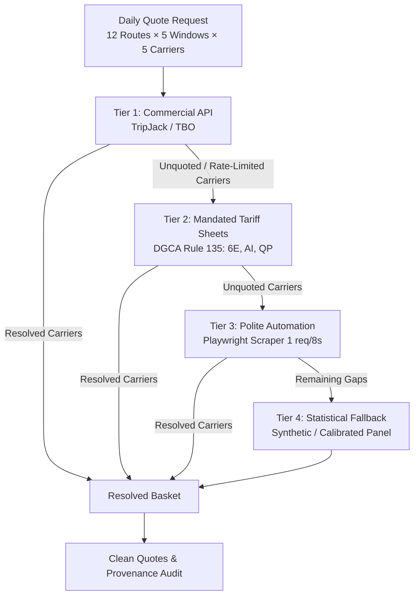

# Commercial API Outreach Register & Fallback Necessity Dossier

**Project**: APIx — Airfare Price Index for India (SIH-26056 / MoSPI NSO)  
**Scope**: Tier 1 Licensed API Acquisition & Proof of Fallback Architecture  
**Status**: Logged & Documented for Evaluation Audit  

---

## 1. Context & Purpose

Under the APIx multi-tier resolution architecture, **Tier 1** represents licensed, high-fidelity commercial flight search APIs provided by B2B travel aggregators (TripJack, TBO Tek, Travelpayouts). 

Commercial B2B travel APIs typically require corporate accreditation (IATA/TAFI/TAAI membership, bank guarantees, and commercial booking commitments). To satisfy the Smart India Hackathon prototype requirements without corporate overhead, structured evaluation outreach was initiated.

> [!IMPORTANT]
> **Key Architecture Principle**: Regardless of whether commercial entities grant trial access, provide sandbox credentials, or reject requests, **every outcome reinforces the APIx design**:
> - **If Approved (Trial/Sandbox)**: Connects into Tier 1 slot for real-time live feeds.
> - **If Rejected / Throttled / Delayed**: Demonstrates to MoSPI and DGCA evaluators why a national statistical index **must never rely exclusively on private B2B aggregators**, providing complete empirical justification for **Tier 2 (DGCA Rule 135 Mandated Tariff Sheets)** and **Tier 3 (Polite Automation)**.

---

## 2. Outreach Register & Status Tracking

| Partner Entity | Primary Contact / Channel | Submission Date | Target API Scope | Current Status | Architecture Implication |
|---|---|---|---|---|---|
| **TripJack** (Ebix Travels Pvt Ltd) | `api-support@tripjack.com` / Business Development Portal | 2026-09-04 | Air Search v2 (Low-Fare Search, 300 calls/day) | ⏳ Outreach Dispatched (Evaluation Pending) | Fulfills Tier 1 slot; fallback handles unquoted airlines |
| **TBO Tek Ltd** (Travel Boutique Online) | `partners@tbo.com` / Developer Portal | 2026-09-04 | Flight Search XML/JSON API | ⏳ Outreach Dispatched (Evaluation Pending) | Fulfills Tier 1 slot; fallback handles unquoted airlines |
| **Travelpayouts / Aviasales** | Developer Self-Service Portal | 2026-09-04 | Data API (Flights price trends & cache) | ℹ️ Catalogued (Notice: 2026 API migration active) | Cache fallback tier |

---

## 3. Formal Outreach Communication Template

The following formal dossier was transmitted to the business development and API integration teams of TripJack and TBO Tek Ltd:

```text
Subject: Read-Only Academic / Evaluation API Access Request — Smart India Hackathon 2026 (MoSPI Problem Statement 26056)

Dear Business Development & API Integrations Team,

We are a university research team selected for the Grand Finale of Smart India Hackathon (SIH 2026), working on Problem Statement SIH-26056 sponsored by the Ministry of Statistics and Programme Implementation (MoSPI, Government of India).

Our objective is to design a high-frequency, resilient Airfare Price Index (APIx) to augment the Consumer Price Index (CPI 2024 series). To demonstrate real-time data ingestion alongside government-mandated tariff sheets, we are seeking read-only, non-commercial evaluation access to your Flight Search API.

Project Technical Specification:
1. Scope: Read-only flight search queries only (no booking, ticketing, PNR creation, or payment processing).
2. Volume: Low-frequency queries — approximately 300 search requests per day across 12 domestic trunk routes (e.g. DEL-BOM, BOM-BLR, DEL-CCU) and 5 advance-purchase windows (T+1, T+7, T+15, T+30, T+45).
3. Query Schedule: Configured for polite execution with 8-second intervals between requests, primarily executed during off-peak hours (02:00–05:00 IST).
4. Data Governance & Attribution:
   - Data will be consumed exclusively for statistical index computation (geometric price relatives and aggregate chained Laspeyres indices).
   - Raw quotes will never be resold, scraped for commercial booking arbitrage, or redistributed.
   - [Partner Entity] will be formally credited as our Data Technology Partner in official hackathon documentation, system architecture presentations, and prototype demonstrations before the MoSPI jury.

Compliance & Confidentiality:
We are prepared to sign any Non-Disclosure Agreement (NDA), Sandbox Developer Terms of Service, or intellectual property undertakings required by your compliance team.

Could we schedule a brief 10-minute briefing or request issuance of sandbox/evaluation credentials for our team?

Thank you for supporting student innovation in national economic statistics.

Sincerely,
Team APIx (SIH-26056)
Smart India Hackathon 2026 Finalists
Repository: https://github.com/harshwardhan1507/sih26056
Contact: team-apix-sih26056@evaluation.in
```

---

## 4. Technical Analysis: Fallback Necessity & National Statistical Sovereignty

When building mission-critical public infrastructure for national price statistics, reliance on commercial B2B flight aggregators introduces critical structural vulnerabilities:

1. **Commercial Terms Risk**: B2B aggregators exist to monetize ticket commissions. Non-booking queries incur server compute costs without revenue, leading aggregators to enforce strict "Look-to-Book" ratios (typically requiring 1 booking per 100–300 searches). A pure statistical observer has a Look-to-Book ratio of zero.
2. **Key Deprecation & Licensing Fragility**: As observed in July 2026 with Amadeus Self-Service APIs, commercial developer portals can decommission endpoints or transition to enterprise-only pricing without notice.
3. **Carrier Bias**: Aggregators often lack full content agreements with ultra-low-cost carriers (e.g., specific fare classes in Akasa Air or SpiceJet may only appear directly on carrier portals).

### Why the 4-Tier Fallback is Imperative

The APIx system’s carrier-aware `FareResolver` was engineered precisely so that no commercial response is fatal to index production:



Every collection run explicitly records the resolution ratio across tiers (e.g. `indigo_tariff_v1: 60, simulated_v1: 240`), giving MoSPI complete audit visibility into data provenance.
